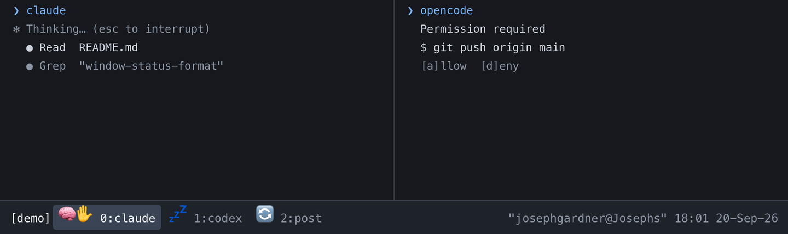

# ✋ tmux Agent Icons
## Claude Code • Codex • OpenCode

Per-window icons in the [tmux](https://github.com/tmux/tmux) status bar, one per agent pane, driven by each agent's own lifecycle events. A few lines of shell, one `tmux set` per event, no poller, no state files.



| Icon | State |
|------|-------|
| 🧠 | Working (thinking, tool use) |
| ✋ | Waiting for you (permission prompt, elicitation, or opencode's `question` tool) |
| 🔄 | Post-processing: a headless `claude -p` running in the pane, e.g. spawned by a hook |
| 💤 | Idle |

Requires tmux ≥ 3.2 (pane user options and `#{P:…}` format loops).

Each agent writes its own pane option — `@claude_state`/`@claude_post`, `@codex_state`, `@opencode_state` — so the three integrations are independent and you can adopt them one at a time. The tmux and shell bits below cover all three; the per-agent sections are self-contained.

## tmux

Add to `~/.tmux.conf` and `tmux source-file ~/.tmux.conf`:

```tmux
set -g window-status-format         '#{P:#{?#{@claude_state},#{?#{==:#{@claude_state},waiting},✋,#{?#{==:#{@claude_state},working},🧠,💤}},#{?#{@claude_post},🔄,}}}}#{P:#{?#{@codex_state},#{?#{==:#{@codex_state},waiting},✋,#{?#{==:#{@codex_state},working},🧠,💤}},}}#{P:#{?#{@opencode_state},#{?#{==:#{@opencode_state},waiting},✋,#{?#{==:#{@opencode_state},working},🧠,💤}},}}#{?#{P:#{@claude_state}#{@claude_post}#{@codex_state}#{@opencode_state}}, ,}#I:#W#{?window_flags,#{window_flags}, }'
set -g window-status-current-format '#{P:#{?#{@claude_state},#{?#{==:#{@claude_state},waiting},✋,#{?#{==:#{@claude_state},working},🧠,💤}},#{?#{@claude_post},🔄,}}}}#{P:#{?#{@codex_state},#{?#{==:#{@codex_state},waiting},✋,#{?#{==:#{@codex_state},working},🧠,💤}},}}#{P:#{?#{@opencode_state},#{?#{==:#{@opencode_state},waiting},✋,#{?#{==:#{@opencode_state},working},🧠,💤}},}}#{?#{P:#{@claude_state}#{@claude_post}#{@codex_state}#{@opencode_state}}, ,}#I:#W#{?window_flags,#{window_flags}, }'
```

If you only use Claude Code, the two-option version in this repo's history is equivalent; these lines just append a Codex and an opencode fragment.

## Claude Code

1. `cp tmux-claude-state.sh ~/.claude/hooks/ && chmod +x ~/.claude/hooks/tmux-claude-state.sh`
2. Merge `claude-tmux-hooks.json` into `~/.claude/settings.json`. Every hook is the same script with the state as its only argument. `PostToolUse` matters: `PreToolUse` fires before the permission prompt, so without it an approved tool call would keep showing ✋ until the next event.
3. (Claude writes `@claude_state`/`@claude_post`; the tmux block above already renders them.)

## Codex

Codex has a lifecycle-hook system. It discovers `hooks.json` next to `config.toml`, and non-managed hooks are skipped until you review and trust them.

1. `cp tmux-agent-state.sh ~/.local/bin/ && chmod +x ~/.local/bin/tmux-agent-state`
2. `cp codex-hooks.json ~/.codex/hooks.json`
3. Start Codex and run `/hooks` to trust the new hooks (or pass `--dangerously-bypass-hook-trust` for one-off automation).

The mapping: `SessionStart`/`Stop`/`Interrupt` → idle, `UserPromptSubmit`/`PreToolUse`/`PostToolUse` → working, `PermissionRequest` → waiting, `SessionEnd` → clear. Codex passes each hook a JSON object on stdin; the script ignores it and takes the state as its argument.

## opencode

opencode plugins subscribe to the server event bus.

1. `cp opencode-tmux-agent-state.ts ~/.config/opencode/plugin/tmux-agent-state.ts`
2. Add it to `~/.config/opencode/opencode.jsonc`:

```json
{
  "$schema": "https://opencode.ai/config.json",
  "plugin": ["./plugin/tmux-agent-state.ts"]
}
```

3. Restart opencode (config and plugins load at startup, not hot-reloaded).

The plugin maps `session.status` → working/idle, `permission.asked` → waiting, `permission.replied` → working, and the `question` tool → waiting until you answer. A blocked turn stays ✋ even if the session reports itself busy while it waits for you.

## How it works

Each event runs `tmux set -p <option> <state>` on its own pane (`$TMUX_PANE`; the writes are no-ops outside tmux). The window format loops the window's panes with `#{P:…}` and maps the option to an icon, so a window with two agent panes shows two icons side by side, followed by a single space. Pane options are freed when the pane closes.

**Headless Claude sessions.** A `claude -p` launched from a hook (a session journal, say) inherits `$TMUX_PANE`, and its own hooks would otherwise flip the tab to 🧠. Claude Code sets `CLAUDE_CODE_ENTRYPOINT=cli` only for interactive sessions (`sdk-cli` for `-p`, `sdk-*` for the SDKs), so `tmux-claude-state.sh` routes non-interactive sessions to a second option, `@claude_post`. The two sessions never write the same key, which is what makes parallel `SessionEnd` hooks safe without any read-modify-write. The format shows the interactive state when present and 🔄 otherwise. Consequence: a `claude -p` you type by hand also shows 🔄.

**Why not tmux `monitor-*` flags?** They are close (bell ≈ waiting, activity ≈ working, silence ≈ idle) but they mean "unseen", so tmux clears them when you look at the window, and the bell cannot tell a permission prompt from an idle nudge. Agent events are the only exact source.

## Crash safety

`SessionEnd` clears the option, but a killed agent cannot. To clear every key whenever the shell gets its prompt back, add to `.zshrc`:

```zsh
autoload -Uz add-zsh-hook
_tmux_agent_state_clear() { [[ -n $TMUX_PANE ]] && tmux set -pu -t "$TMUX_PANE" @claude_state \; set -pu -t "$TMUX_PANE" @claude_post \; set -pu -t "$TMUX_PANE" @codex_state \; set -pu -t "$TMUX_PANE" @opencode_state 2>/dev/null; return 0 }
add-zsh-hook precmd _tmux_agent_state_clear
```

## Alignment

The post-processing icon is 🔄 (`U+1F504`), a plain double-width emoji like the rest. An earlier version used ♻️ (`U+267B U+FE0F`); the trailing variation selector made tmux and the terminal disagree on its width, so it could render blank or shift the tab until a redraw. If your terminal still mishandles any of these, swap the emoji for a single-cell glyph or colour the tab name instead, e.g. `#{?#{==:#{@claude_state},waiting},#[fg=yellow],}`.

## Alternatives

[tmux-tab-pulse](https://github.com/rafaelsales/tmux-tab-pulse) (TPM, spinner, marks any busy process, background daemon), [tmux-agent-indicator](https://github.com/accessd/tmux-agent-indicator) (TPM, Claude + Codex + OpenCode, pane borders), [partner0/tmux-agent-status](https://github.com/partner0/tmux-agent-status) (same mechanism, renames the window). None distinguish a headless child session from the pane's owner.
